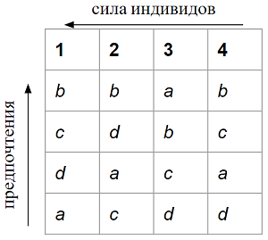

class: animated, fadeIn

## План

- Равновесие: общее представление

- Экономика джунглей: введение

- Экономика джунглей: равновесие

- Домашнее задание

- В&О

---
class: animated, fadeIn
## Чтение

**Основное:**

- OR, гл. 8

 

**Дополнительно:**

- Piccione, M., & Rubinstein, A. (2007). Equilibrium in the Jungle. *The Economic Journal*, 117(522), 883-896.

- OR, гл. 1

---
class: section, animated, zoomIn

## Экономика Джунглей

 

### Основные понятия и проблемы

---
class: animated, fadeIn
## .gb[Пример 1.1]
*Представим общество, состоящее из 4 индивидов и 4 домов. Каждый дом может быть занят одним индивидом. Индивиды имеют предпочтения относительно домов и разную силу:*

.center[]

---
class: animated, fadeIn
## Джунгли

**Джунгли** состоят из **общества** и **отношений силы**

--

**Общество:** 

- *индивиды*, $N$

- *дома*, в том же количестве, $H$

- *предпочтения:* полные, строгие бинарные отношения каждого индивида на множестве домов, $\{\succeq^i\}_{i\in N}$

--

**Отношения силы:** полные, транзитивные, антисимметричные парные отношения на множестве индивидов, $\triangleright$

---
class: animated, fadeIn
## Размещение и равновесие

**Назначение** - это функция, заданная для общества, которая приписывает каждому индивиду один из домов

$$a:N\to H$$

--

**Размещение** - это такое назначение, что каждый дом приписан ровно одному индивиду

--

**Равновесие в джунглях** - такое размещение $a^*$, что не существует такой пары индивидов $i,j\in N$, чтобы

$$i\triangleright j,\;\&\; a^*(j)\succeq^i a^*(i)$$
---
class: animated, fadeIn
## .gb[Пример 1.1] (продолжение)
*Представим общество, состоящее из 4 индивидов и 4 домов. Каждый дом может быть занят одним индивидом. Индивиды имеют предпочтения относительно домов и разную силу:*

.center[]

.bb[?] Есть ли в этих Джунглях равновесие? Какое? А есть еще?

---
class: section, animated, rotateIn

# Первый фундаментальный результат

---
class: animated, fadeIn
## Существование и единственность

В любых Джунглях существует равновесие, 
и при этом оно единственное.

--

 

.bb[?] Как это доказать?

---
class: animated, fadeIn
## Последовательная диктатура

**Последовательная диктатура** - это принцип построения размещения в джунглях.

--

Сильнейший индивид получает наиболее предпочтительный для него дом. Каждый следующий в ранге индивид получает наилучший для него дом, выбранный из всех еще не распределенных домов.

--

.rb[NB!] *Размещение, построенное посредством последовательной диктатуры, является равновесием.*

---
class: animated, fadeIn
## Домашнее задание 0

- Сформировать группы для выполнения ДР

- Назначить лидеров групп

- Лидерам групп отчитаться в телеграм до 18:00 21.01

--

**Группа для выполнения ДР:**

- 3-6 человек, один выбирается лидером

- Состав в течение курса не меняется

- Связь со мной через лидера группы в телеграм

---
class: animated, fadeIn
## Домашнее задание 1 .pull-right[.rmk[до 18:00 22.01]]

- Доказать, что последовательная диктатура приводит к равновесию в Джунглях

- Доказать единственность равновесия в Джунглях

- Задача 1а в OR, стр. 118

--

- решение не обязательно должно быть строго формальным, но должно быть оформлено аккуратно и в электронном виде (не скан/фото)

---
class: middle, center, animated, rotateIn

### Вся важная инфа в телеграм-канале!

# Увидимся в следующий раз!
